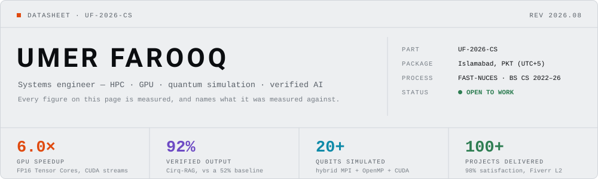

<picture>
  <source media="(prefers-color-scheme: dark)" srcset="assets/header-dark.svg">
  
</picture>

<p align="center">
  <a href="#01--summary"><b>Summary</b></a> ·
  <a href="#02--measured-characteristics"><b>Characteristics</b></a> ·
  <a href="#03--functional-blocks"><b>Blocks</b></a> ·
  <a href="#04--operating-modes"><b>Modes</b></a> ·
  <a href="#05--typical-applications"><b>Applications</b></a> ·
  <a href="#06--instruction-set"><b>Instruction set</b></a> ·
  <a href="#07--qualification"><b>Qualification</b></a> ·
  <a href="#09--ordering-information"><b>Contact</b></a>
  <br>
  <a href="https://umerfarooqcs.me/"><b>umerfarooqcs.me</b></a> ·
  <a href="https://www.linkedin.com/in/umer-farooq-a0838a2a1/">LinkedIn</a> ·
  <a href="mailto:umerfarooqcs0891@gmail.com">Email</a> ·
  <a href="https://umerfarooqcs.me/cv/">CV</a>
</p>

---

# Systems engineer — HPC, GPU, quantum simulation, and AI that gets checked

## 01 — Summary

I'm **Umer Farooq**. I work on the layer where a program meets the machine it runs on: CUDA kernels
and MPI ranks, quantum circuits and the simulators underneath them, and AI pipelines that validate
their own output instead of assuming it. Final-year CS at FAST-NUCES Islamabad, third place at the
Huawei ICT Competition national finals, and 30 projects behind me.

This README is written as a datasheet, and it follows the rule a datasheet follows: **no figure
appears without the baseline it was measured against.** A "6× speedup" that doesn't say
*six times faster than what* isn't a result, it's a slogan.

| Parameter | Value |
|---|---|
| **Part** | `UF-2026-CS` |
| **Package** | Islamabad, Pakistan · PKT (UTC+5) |
| **Process** | BS Computer Science, FAST-NUCES Islamabad · Aug 2022 – Jun 2026 (expected) |
| **Operating modes** | Development · Infrastructure · Solution architecture — [see §04](#04--operating-modes) |
| **Status** | Open to internships, contract work, and research collaboration |
| **Full portfolio** | **[umerfarooqcs.me](https://umerfarooqcs.me/)** — 30 projects, runnable demos, live CV |

---

## 02 — Measured characteristics

<picture>
  <source media="(prefers-color-scheme: dark)" srcset="assets/speedup-dark.svg">
  
</picture>

**Speedup — one measure, one unit, one baseline.**

| Workload | Baseline | Measured | How it was reached |
|---|---|---|---|
| [MNIST inference](https://github.com/Umer-Farooq-CS/MNIST-Classification) | serial CPU (V1) | **6.0×** | FP16 Tensor Cores, kernel fusion, CUDA streams, coalesced access |
| [Canny edge detection](https://github.com/Umer-Farooq-CS/Canny-Edge-Detector) | sequential CPU | **3.5×** | tiled shared memory, texture cache, padding against bank conflicts |
| [RNN training](https://github.com/Umer-Farooq-CS/RNN-Character-Level-Text-Generation) | FP32 training | **3.5×** | automatic mixed precision, large batches, GPU-resident data |
| DiT image generation | U-Net diffusion | **1.3×** | REG/REPA on a ViT backbone, at FID 18.7 |
| 2D render loop | first working build | **1.3×** | hand-written physics and collision in C++/SFML |

Quality is a different unit, so it gets its own table rather than a second axis on that chart.

| Task | Baseline | Result | Metric |
|---|---|---|---|
| [Quantum circuit generation](https://github.com/Umer-Farooq-CS/Cirq-RAG-Code-Assistant) | 52% (single agent) | **92%** | share of prompts producing an executable, validated Cirq circuit |
| [CIFAR-10 classification](https://github.com/Umer-Farooq-CS/CNN-CIFAR10-Classification-GPU-Optimized) | — | **88.82%** | top-1, best of an 81-combination hyperparameter sweep |
| Financial sentiment | 86.42% (local Mistral) | **94.73%** | 3-class accuracy on Financial PhraseBank, FinBERT |
| [Waste detection (TACO)](https://github.com/Umer-Farooq-CS/Waste-Object-Detection-Segmentation) | untuned YOLOv8-n | **2.2×** | mAP@50 improvement, five most frequent classes |
| Semantic product search | — | **0.85 / 0.79** | Precision@1 / NDCG@5, neural learning-to-rank |
| MNIST, after the 6.0× | 99%+ | **99%+** | accuracy held while GPU utilization reached 95%+ |

> The last row is the one that matters most. Any kernel can be made fast if it is allowed to be
> wrong; the constraint is holding accuracy while the clock comes down.

---

## 03 — Functional blocks

<picture>
  <source media="(prefers-color-scheme: dark)" srcset="assets/blocks-dark.svg">
  
</picture>

The dashed line along the bottom is the part I'd argue for. Every block feeds its own output back
into its input: a kernel gets profiled and re-tuned, a circuit gets simulated and compared, a
generated program gets executed and repaired when it fails. That loop is why
[Cirq-RAG](https://github.com/Umer-Farooq-CS/Cirq-RAG-Code-Assistant) reaches 92% where a single
unchecked generation pass reaches 52% — same model, same knowledge base, one added habit of
checking the answer before returning it.

### Stack, by block

| Block | Stack |
|---|---|
| **Parallelisation** | `CUDA` `OpenMP` `MPI` `pthreads` `METIS` `Tensor Cores` `FP16` `Nsight Systems` `Nsight Compute` `perf` `Valgrind` |
| **Quantum simulation** | `Qiskit` `Cirq` `PennyLane` `OpenQASM 3.0` `JAX` `tensor networks` |
| **Verified AI** | `PyTorch` `TensorFlow` `Keras` `HuggingFace` `FAISS` `RAG` `multi-agent` `Sentence-BERT` `CLIP` `Ollama` `NDCG/MAP` |
| **Platform & delivery** | `TypeScript` `React` `Next.js` `Node.js` `Express` `FastAPI` `.NET 8` `PostgreSQL` `MongoDB` `MySQL` `Docker` `Kubernetes` `GitHub Actions` |
| **Languages** | `C` `C++17` `CUDA C++` `Python` `TypeScript` `JavaScript` `Java` `C#` `SQL` |

---

## 04 — Operating modes

Same person, same projects, three ways of reading them. The
[portfolio](https://umerfarooqcs.me/) is built around this: pick a mode and the site reorders
itself — which chapters lead, which skills come first, which facet of each project is put forward.
No project gets a second, mode-specific write-up; a mode only chooses what to lead with.

| Mode | Reads as | Leads with |
|---|---|---|
| **A · Development** | *"I make slow systems fast, and hard systems runnable."* | kernels, parallel models, training pipelines, language tooling |
| **B · Infrastructure** | *"I turn raw compute into platforms that scale, and stay up."* | GPU scheduling, Kubernetes job management, cluster and runtime concerns |
| **C · Solution architecture** | *"I turn requirements into architectures that hold up."* | requirements, trade-offs, technology selection, and defending both |

---

## 05 — Typical applications

Thirty projects. The ones with a repo link are public; the rest are coursework or client work whose
code isn't mine to publish. Every result quoted here is repeated from §02 rather than invented for
the list.

### HPC & GPU

| Project | What it is | Result |
|---|---|---|
| **[Q-Tensor](https://github.com/Umer-Farooq-CS/Q-Tensor)** | Tensor-network quantum circuit simulator, hybrid MPI + OpenMP with CUDA-accelerated contractions and METIS partitioning | scales to 20+ qubit circuits |
| **[MNIST on GPU](https://github.com/Umer-Farooq-CS/MNIST-Classification)** | Five versions, V1 serial CPU through V5 Tensor Cores, each profiled in Nsight | 6.0× inference, 95%+ utilization |
| **[Canny edge detector](https://github.com/Umer-Farooq-CS/Canny-Edge-Detector)** | Full CUDA pipeline: Gaussian blur, Sobel, non-maximum suppression, hysteresis | 3.5× over sequential CPU |
| **Parallel graph & text analysis** | pthreads with thread affinity and cache-aware chunking, contention found with `perf` | near-linear multi-core scaling |

### Quantum

| Project | What it is | Result |
|---|---|---|
| **[QCanvas](https://github.com/Umer-Farooq-CS/QCanvas)** | Cirq, Qiskit and PennyLane behind one interface, with OpenQASM 3.0 as the exchange format and a Kubernetes job manager scheduling simulations | 3rd place, Huawei ICT national finals |
| **[Cirq-RAG](https://github.com/Umer-Farooq-CS/Cirq-RAG-Code-Assistant)** | Natural language to executable quantum circuits, via Designer → Validator → Optimizer → Educator with a real retry loop | 92% vs a 52% single-agent baseline |
| **[Braket-RAG](https://github.com/Umer-Farooq-CS/Braket-RAG-Code-Assistant)** | The same validation-first approach carried across to AWS Braket | — |
| **[UniQ](https://github.com/Umer-Farooq-CS/UniQ)** | The research prototype QCanvas grew out of | — |

### AI & ML

| Project | What it is | Result |
|---|---|---|
| **[AgentScript Studio](https://github.com/Umer-Farooq-CS/AgentScript-Studio)** | End-to-end pipeline that ingests scripts and transforms them into structured, agent-usable form | — |
| **[CNN on CIFAR-10](https://github.com/Umer-Farooq-CS/CNN-CIFAR10-Classification-GPU-Optimized)** | 81-combination sweep over learning rate, batch size, filters and depth, with mixed precision and XLA | 88.82% top-1 |
| **[PixelRNN](https://github.com/Umer-Farooq-CS/PixelRNN-Implementation-CIFAR10)** | van den Oord et al. reimplemented: PixelCNN, Row LSTM, Diagonal BiLSTM, masked convolutions | NLL / bits-per-dim evaluated |
| **[Character-level RNN](https://github.com/Umer-Farooq-CS/RNN-Character-Level-Text-Generation)** | 5.8M-parameter, 3-layer LSTM over Shakespeare, trained with AMP | 3.5× faster training, 55.2% accuracy |
| **[Waste detection](https://github.com/Umer-Farooq-CS/Waste-Object-Detection-Segmentation)** | YOLOv8-n detection plus a custom U-Net for segmentation on TACO | 2.2× mAP@50 |
| **[Semantic search assistant](https://github.com/Umer-Farooq-CS/semantic-search-research-assistant)** | Retrieval module for a research assistant, Streamlit front end | — |

<details>
<summary><b>Nine more AI &amp; ML projects</b></summary>

<br>

| Project | What it is | Result |
|---|---|---|
| **Multimodal RAG for PDFs** | OCR, text and image embeddings, semantic retrieval and grounded generation over PDFs — EasyOCR, Sentence-BERT, CLIP, FAISS, Ollama | Streamlit chat over mixed-media documents |
| **Financial sentiment & topic modelling** | FinBERT against a local Mistral and a RAG-augmented LLM on Financial PhraseBank, plus 15-topic LDA | 94.73% vs 86.42% |
| **English → Urdu translation** | mBART-large-50 fine-tuned on a 33,020-pair multi-domain corpus, with a Flask interface | BLEU 0.302, training cut to ~1.5–3h |
| **Diffusion Transformers (DiT)** | ViT-backbone diffusion with REG/REPA, measured against a U-Net baseline | FID 18.7, ~30% faster training |
| **CycleGAN face ↔ sketch** | Unpaired image-to-image translation with cycle-consistency and identity losses | Flask demo |
| **Semantic product search** | TF-IDF, Word2Vec and BERT-style embeddings feeding a neural ranking model | P@1 0.85, NDCG@5 0.79, F1@10 0.68 |
| **CIFAR-10 model suite** | ANN vs CNN vs hybrid, one YAML config per model, checkpointing and TensorBoard throughout | reproducible three-way comparison |
| **[California housing regression](https://github.com/Umer-Farooq-CS/California-Housing-Regression)** | Five-phase protocol — EDA, single-feature, polynomial, hold-out, 5-fold CV — closed-form against SGD | MSE / RMSE / MAE / R² reported |
| **[Uni-Prep](https://github.com/Umer-Farooq-CS/Uni-Prep)** | Generative-AI study tooling | — |

</details>

### Systems & distributed

| Project | What it is | Result |
|---|---|---|
| **Ring DHT with IPFS** | Chord-style ring over 160-bit SHA-1, O(log N) finger-table routing, B-tree local storage, replication and fault tolerance | lookups survive nodes joining and leaving |
| **Doodle Dash** | Multiplayer drawing game: multi-threaded TCP server, game rooms, delta-encoded stroke protocol, SFML canvas | concurrent rooms without head-of-line blocking |
| **[SecureChat](https://github.com/Umer-Farooq-CS/SecureChat)** | Console chat over PKI with RSA and Diffie–Hellman key exchange | — |
| **[IU compiler](https://github.com/Umer-Farooq-CS/Compiler-Construction)** | A custom language end to end — [lexer](https://github.com/Umer-Farooq-CS/IU-Lexical-Analyzer), parser, semantic analyser, code generator, symbol table, optimisation passes | complete front-to-back toolchain |
| **[LL(1) parser toolkit](https://github.com/Umer-Farooq-CS/LL1-Parser-Plus)** | FIRST/FOLLOW sets, LL(1) table construction, left-recursion elimination, left factoring, step-by-step trace | grammar in, predictive parser out |

### Full-stack & platforms

| Project | What it is | Result |
|---|---|---|
| **[Harmoniq](https://github.com/Umer-Farooq-CS/Harmoniq)** | Audio library explorer: Express REST API with range-request streaming, React front end with waveform view, PostgreSQL full-text search | seek and resume, not file download |
| **ASCO Services API** | .NET 8 Web API — JWT auth, RBAC, repository/service split, EF Core over PostgreSQL, Swagger, dockerised | an API a client team can integrate against |
| **DJ web application** | MERN with WebSockets carrying playback state and MongoDB/GridFS holding media | every listener hears the same mix |
| **[Portfolio](https://github.com/Umer-Farooq-CS/portfolio)** | React 18 + TS + Vite + Tailwind 4, zod-validated content, prerendered routes, axe-clean on 12 routes in both themes | 176.6 KB gzip first load |
| **[HPC reference architecture](https://github.com/Umer-Farooq-CS/hpc-reference-architecture)** | Reference architecture documentation for HPC deployments | — |

<details>
<summary><b>Desktop applications &amp; games</b></summary>

<br>

| Project | What it is | Result |
|---|---|---|
| **Pac-Man with threaded ghost AI** | A* pathfinding with distinct Blinky/Pinky/Inky/Clyde behaviours, one pthread per ghost, SFML rendering | 60+ FPS |
| **2D game suite** | Snake, Tetris and an RPG prototype in C++ with SFML and SDL2, custom physics and collision | 30%+ faster render loop |
| **Student management system** | JavaFX over PostgreSQL — courses, attendance, fees, reporting, BCrypt auth and RBAC, multi-threaded TCP server | MVC end to end |
| **Torrent management system** | JavaFX P2P client: multi-threaded download, seeding, piece selection, resume | live speed and peer view |
| **.NET desktop applications** | C# with WPF and Windows Forms over PostgreSQL, MVC and MVVM, ADO.NET and EF | sized for 100+ concurrent users |

</details>

---

## 06 — Instruction set

<picture>
  <source media="(prefers-color-scheme: dark)" srcset="assets/console-dark.svg">
  
</picture>

Each of those six is written from the visitor's side of the screen — the problem you arrived with,
not a capability I want to advertise. Each has its own scoped deliverables on the portfolio's
[services page](https://umerfarooqcs.me/services/), and the contact form arrives pre-filled with
the questions I'd have to ask anyway.

---

## 07 — Qualification

### Experience

| Period | Role | Where |
|---|---|---|
| **Sep 2025 – present** | **Software engineer** — building the browser-side simulation interface and the Python compute services behind it, so a circuit can be run and inspected without a local quantum toolchain. Qiskit, Cirq and PennyLane behind one interface, OpenQASM 3.0 between them. | Open Quantum Workbench, FAST-NUCES |
| **Aug 2023 – Aug 2024** | **Freelance developer, Level 2 seller** — 100+ projects closed at 98% satisfaction and 80% repeat custom, delivered ~20% ahead of the agreed date. 30+ full-stack MERN and .NET applications, C++ games with SFML and SDL2, and C#/Java line-of-business desktop apps over PostgreSQL and MySQL. | Fiverr |
| **Feb – May 2025** | **Core team, PR & marketing / communications officer** — community partners across 15+ universities, inter-university meetings, RSVP tracking, and speaker and sponsor confirmations for one of Pakistan's largest student-run technology conferences. | NaSCon'25, FAST-NUCES |

### Education

**BS Computer Science** — National University of Computer and Emerging Sciences (FAST-NUCES),
Islamabad · Aug 2022 – Jun 2026 (expected) · **Dean's List, Spring 2023**

`High-Performance Computing` `Parallel & Distributed Computing` `Compiler Construction`
`Operating Systems` `Advanced Programming` `Data Structures & Algorithms` `Database Systems`
`Computer Networks` `Artificial Intelligence` `Machine Learning`

### Certifications & awards

| Year | Credential | Issued by / verify |
|---|---|---|
| 2025 | **Oracle Cloud Infrastructure Certified Generative AI Professional** | [verify](https://catalog-education.oracle.com/pls/certview/sharebadge?id=BBA28841241A387615C60D761D610210FCC9BC8028300E10D96E95890EEB68B7) |
| 2025 | **Oracle Cloud Infrastructure Certified AI Foundations Associate** | Oracle |
| 2024 | **3rd prize — Huawei ICT Competition, national finals** | with the UniQ team, for QCanvas |
| 2024 | **Level 2 seller** | Fiverr — 100+ projects at 98% satisfaction |
| 2023 | **Dean's List** | FAST-NUCES, Spring 2023 |

**Languages** — Urdu (native/bilingual) · English (native/bilingual) · Japanese (elementary)

---

## 08 — Activity

Live from the GitHub API, regenerated daily — the one part of this page I don't get to write.

<p align="center">
  <picture>
    <source media="(prefers-color-scheme: dark)" srcset="https://raw.githubusercontent.com/Umer-Farooq-CS/Umer-Farooq-CS/cards/profile-summary-card-output/slateorange/3-stats.svg">
    
  </picture>
  <picture>
    <source media="(prefers-color-scheme: dark)" srcset="https://raw.githubusercontent.com/Umer-Farooq-CS/Umer-Farooq-CS/cards/profile-summary-card-output/slateorange/1-repos-per-language.svg">
    
  </picture>
  <picture>
    <source media="(prefers-color-scheme: dark)" srcset="https://raw.githubusercontent.com/Umer-Farooq-CS/Umer-Farooq-CS/cards/profile-summary-card-output/slateorange/4-productive-time.svg">
    
  </picture>
</p>

<picture>
  <source media="(prefers-color-scheme: dark)" srcset="https://raw.githubusercontent.com/Umer-Farooq-CS/Umer-Farooq-CS/output/github-contribution-grid-snake-dark.svg">
  
</picture>

---

## 09 — Ordering information

| Channel | Where |
|---|---|
| **Email** | [umerfarooqcs0891@gmail.com](mailto:umerfarooqcs0891@gmail.com) |
| **LinkedIn** | [umer-farooq-a0838a2a1](https://www.linkedin.com/in/umer-farooq-a0838a2a1/) |
| **Portfolio** | [umerfarooqcs.me](https://umerfarooqcs.me/) — with [runnable demos](https://umerfarooqcs.me/lab/): a parallel benchmark that runs on *your* machine, and a 3-qubit simulator that exports OpenQASM 3.0, Qiskit and Cirq |
| **CV** | [live](https://umerfarooqcs.me/cv/) · [PDF](https://umerfarooqcs.me/umer-farooq-cv.pdf) · [general](docs/Umer-Farooq_CV.pdf) · [HPC](docs/Umer-Farooq-HPC_Resume.pdf) · [software engineering](docs/Umer-Farooq_SE.pdf) |
| **Location** | Islamabad, Pakistan · PKT (UTC+5) · open to remote |
| **Available for** | internships · contract work · research collaboration · open source |

If you're reading this with a specific problem, [§06](#06--instruction-set) is the fastest way in:
name the problem, and I'll tell you whether it's one I can actually help with before either of us
spends a week finding out.

---

<details>
<summary><b>How this README is built</b></summary>

<br>

Nothing on this page is fetched from a third-party badge service at render time, and nothing
decorative is drawn. The eight SVGs under `assets/` are generated from one data file, in light and
dark cuts, by a script with no dependencies:

```
scripts/data.mjs           every figure, string and label — the single source of truth
scripts/build-assets.mjs   renders assets/{header,speedup,blocks,console}-{light,dark}.svg
```

```bash
node scripts/build-assets.mjs           # regenerate assets/
node scripts/build-assets.mjs --check   # exit 1 if assets/ has drifted from data.mjs
```

The `--check` mode runs in CI, so a figure can't be edited in `data.mjs` without the picture
following it, and a picture can't be hand-edited to say something the data doesn't.

Two files per asset rather than one, because an SVG loaded through `` resolves
`prefers-color-scheme` against the operating system, not against the GitHub theme you actually
chose — `<picture>` is what respects the latter. The two accent palettes are not a flip of each
other: each was checked against its own surface for the OKLCH lightness band, the chroma floor,
colour-vision separation under simulated protanopia and deuteranopia, and WCAG contrast, and these
are the values that passed on both sides. Motion is declared only inside
`@media (prefers-reduced-motion: no-preference)`, so the static chart is the default and the
animation is the enhancement.

The two live sections are the exception, and they're labelled as such: §08 pulls from the GitHub
API through scheduled workflows that publish to the `cards` and `output` branches.

</details>

<p align="center">
  <sub>
    <code>UF-2026-CS</code> · rev 2026.08 · every figure measured, every baseline named
    · <a href="https://umerfarooqcs.me/">umerfarooqcs.me</a>
  </sub>
</p>
